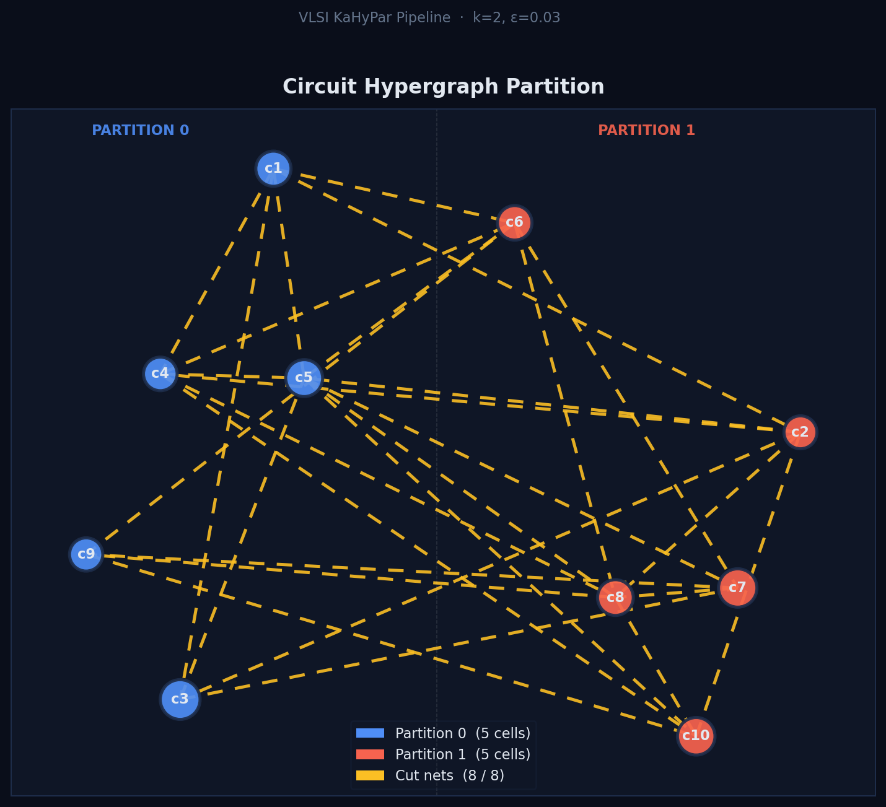
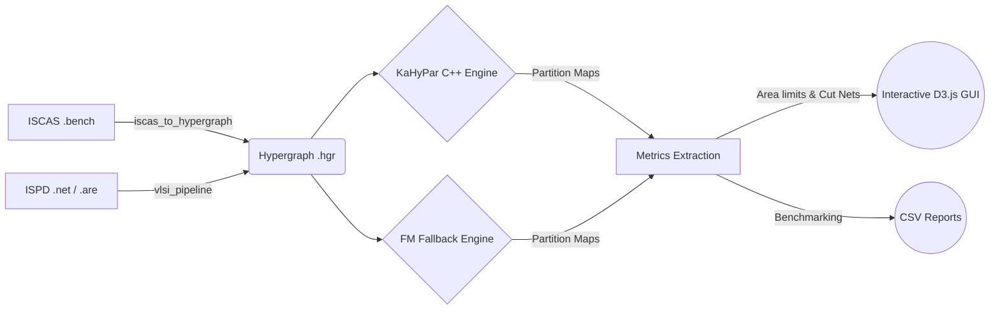

<div align="center">
  

  # ⚡ VLSI KaHyPar Pipeline

  **A Professional Hypergraph Partitioning & Visualization Suite for VLSI Circuits**

  [](https://www.python.org)
  [](https://github.com/kahypar/kahypar)
  [](https://d3js.org/)
  [](https://opensource.org/licenses/MIT)

  <p align="center">
    Seamlessly parse ISPD / ISCAS formats, generate hypergraphs, compute minimal cut nets, and interactively explore the partitioning results directly in your browser.
  </p>
</div>

---

## 🌟 Highlights

- **🔌 Universal Compatibility:** Natively handles standard `.net` / `.are` VLSI datasets as well as legacy ISCAS `.bench` formats.
- **🚀 Dual-Engine Partitioning:** Harnesses the state-of-the-art **KaHyPar** framework for minimal cut hypergraph partitions. Features a fallback to a built-in *Fiduccia-Mattheyses (FM)* solver if the binary isn't detected.
- **📈 Advanced Analytics Engine:** Computes real-world physical metrics like **Area Balance (1 ± ε)** and absolute VLSI cut nets.
- **🖼️ D3.js Visualizer:** Automatically generates a standalone Interactive HTML interface with physics-based layout for visualizing intra-partition density boundaries.
- **🧪 Multi-Seed Benchmarker:** Iterates across numerous RNG seeds dynamically to isolate your highest quality partitioning configuration.

---

## 🏗️ Architecture Flow



---

## 🛠️ Project Modules

### 1️⃣ Pipeline Operator (`vlsi_kahypar_pipeline.py`)
A single-command hub designed for speed. Parses datasets, streams data to algorithms, outputs logs, and injects results into the `.html` viewer automatically.

### 2️⃣ Statistical Runner (`kahypar_runner.py`)
Built for researchers. Performs multi-seed validation, generates detailed textual and CSV metric summaries, and renders high-density layout mapping maps with matplotlib.

### 3️⃣ Benchmark Bridge (`iscas_to_hypergraph.py`)
Pre-processes gate-level benchmark designs (ISCAS85 / ISCAS89). Converts gate definitions to standard uniform-weight bipartite nodes.

---

## 🚀 Quick Start Guide

### Installation
Clone this repository and ensure you have `matplotlib` available for plotting:
```bash
git clone https://github.com/RishitTandon7/kahypar.git
cd kahypar
pip install matplotlib
```

*(Optional) Install the official KaHyPar binary for optimal cuts:*
```bash
git clone --recursive https://github.com/kahypar/kahypar.git
cd kahypar && mkdir build && cd build
cmake .. -DCMAKE_BUILD_TYPE=Release && make -j4
```

### Main Pipeline
Execute the full mapping workflow on any circuit bundle:
```bash
python vlsi_kahypar_pipeline.py circuit.net circuit.are --gui
```
* **`--gui`**: Renders dynamic graph representations inside a self-contained browser tab.
* **`--dry-run`**: Ignores external C++ partitions and forcefully selects the built-in FM orchestrator.

### Multi-Seed Tuning
Stress-test circuit parameters to achieve minimal net crossings.
```bash
python kahypar_runner.py ibm01.net ibm01.are --seeds 0,1,2,3,4,5,6 --csv --gui
```

### Format Converter
```bash
python iscas_to_hypergraph.py c17.bench
```

---

## 💡 Why VLSI Cut Metrics over Abstract Math?
Standard hypergraph tools score results purely on edge weight algorithms. Our pipeline extends these parameters to apply literal physically-derived VLSI constraints, ensuring that logic gate footprints (area maps) adhere precisely to hardware bounds.

<div align="center">
  <br>
  <i>Empowering next-gen EDA & Placement mapping. Contributions are strictly welcomed!</i>
  <br>
</div>
